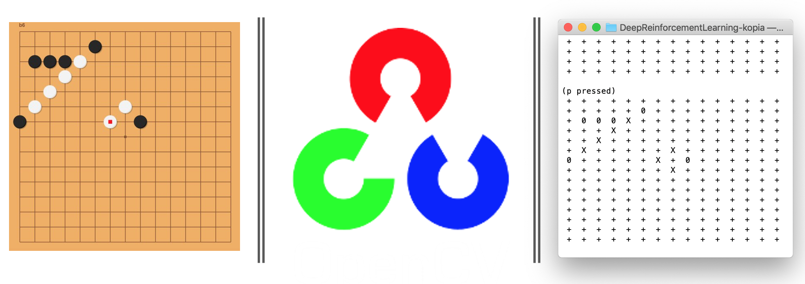
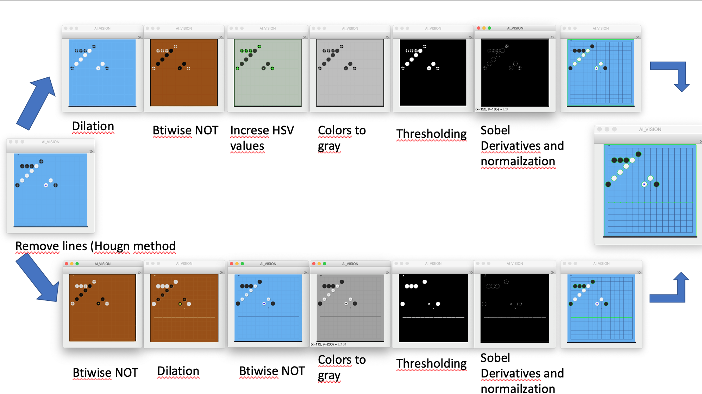
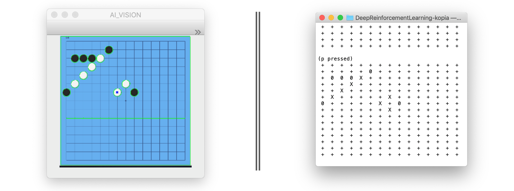
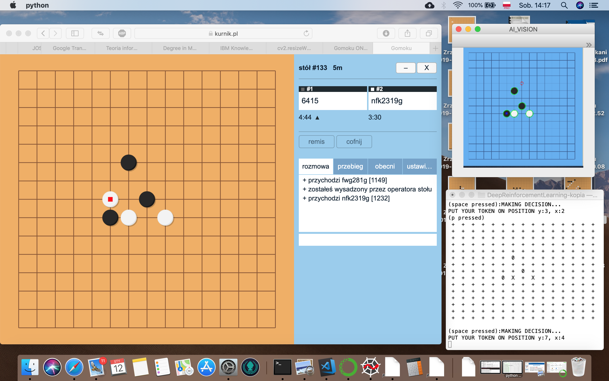

# Self-playing bot for GOMOKU with computer vision on board
A code to learn bot to play GOMOKU (5 in a row) game from website: https://www.kurnik.pl/gomoku/
## Vision
I used OpenCV library for Python 3 to transform image from screen into digital input for the bot:



### Some instructions
As far as my computer does not have enough performance to train a good bot I simply trained very basic brain and upload it with source code, it is usefull only for checking functionality of the project.

To train your own brain read `run` jupyter's notebook. 

To run bot: 
```
python gomoku.py
```
Here is screenshot of my setup to play GOMOKU:


